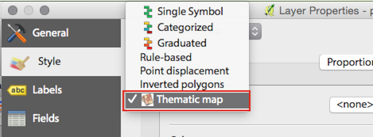
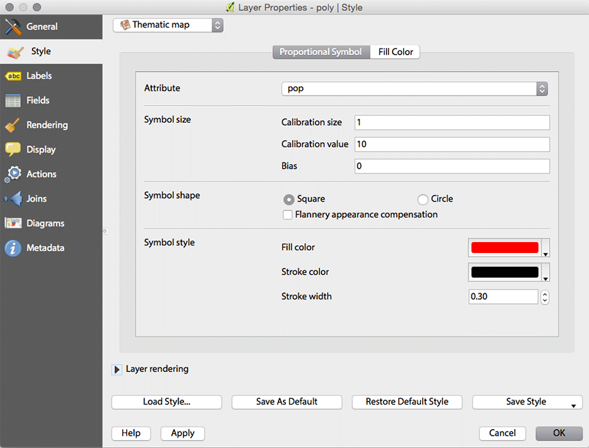
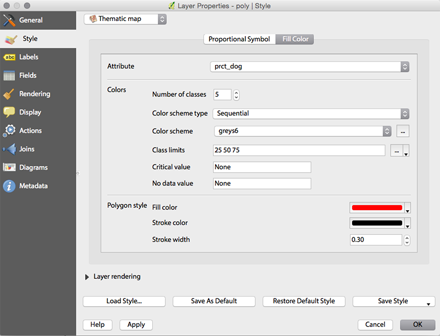
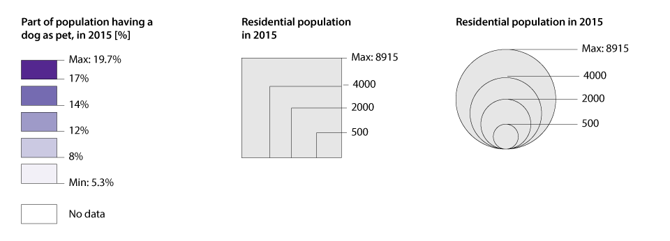
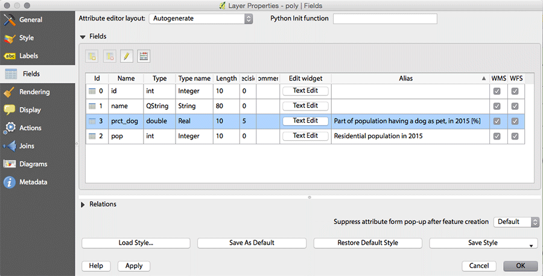

# ThemaMap

ThemaMap is a QGIS plugin for rendering the following types of thematic maps:

- Choropleth maps.
- Proportional symbols with square or circle symbols. Circle symbols can be optionnally drawn with Flannery compensation.
- Colored proportional symbols, which is a combination of the two above map types.

ThemaMap works both with polygon and point layers. For proportional symbol maps, the bigger symbols are automatically placed behind the small ones, to insure no symbol is completely hidden by another one.

ThemaMap is available in the QGIS style dialog, in the "Thematic map" style type:

The ThemaMap style dialog is organized in two tabs, the first for *proportional symbols* and the second for the *fill style*. In each case, an attribute can be defined. Depending if an attribute is defined for the one or other case, for both, or for none, the map is rendered differently:

- **Attribute is defined only for the proportional symbols**: simple proportional symbols are drawn using the specified symbol style at the bottom of the section. In case of a polygon layer, the polygons are rendered below the proportional symbols, using the polygon style properties defined at the bottom of the *fill color* section.

-  **Attribute is defined only for the fill color**: a simple choropleth map is rendered with no symbols. The polygon style at the bottom of the section is applied for the stroke color and width only, except for polygons with no data where the polygon style fill color is used. This type of map can only be rendered for polygon layers.

- **Attributes are defined for both proportional symbols and fill color**: a colored proportional symbol map is rendered. Instead of filling the polygons like in the choropleth map, the symbols are instead filled. In the case of a polygon layer, the polygons are rendered below the symbols using the polygon style properties. Symbols where the fill color attribute value is missing are rendered with the default symbol style.

- **No attribute is defined**: point layers are rendered using the symbol style and shape, at the size defined by *Calibration size*. Polygon layers are rendered using the polygon style in the *Fill color* tab.

## Proportional symbol options

The **attribute** menu shows all numeric fields of the layer, and also a *<none>* option for disabling rendering of a proportional symbol.

The **symbol size** specifies how big a proportional symbol should be rendered in compare with the attribute values. the **calibration size** specifies the size of the symbol, in points, for the corresponding **calibration value** specified below. The **bias** is a constant value which is added automatically to every attribute value in order to avoid too small symbols. Based on these values, the symbol size can be calculated as follows:

	r = ((x / cx) * cr^2)^0.5
	
where *r* is the symbol radius (for symbol size multiply by 2), *x* is the attribute value, *cx* is the calibration value, and *cr*is half of the calibration size.

In the case where the *Flannery appearance compensation* is checked, a slightly different formula is used:

	r = ((x / cx) * cr^2)^0.57

The *Flannery appearance compensation* applies only to circles and is deactivated in case of square symbols.

## Fill color options (choropleth map)

The **colors* section of the dialog allows to define the choropleth map properties. The number of classes defines how many different color tones will be used. The maximum number possible is 9.

The **color scheme type** allows to filter the available color tables. The **color scheme** menu allows to choose the color table to use. By default, all color tables from [ColorBrewer 2](http://colorbrewer2.org) are available. The color scheme menu shows the name and a small thumbnail of all the colors. The button at the right side of the menu allows for defining custom color schemes.

The **class limits** text box allows for defining the limits between the classes. For 5 classes, there are 3 limits, the maximum and minimum attribute values being a limit by themselves. Class limits are simply separated by a space. The button at the right of the text box allows is a dropdown menu which allows calculating automatically the optimal class limits using the Jenks algorithm.

The **critical value** is used for divergent color schemes. It specifies the value where the color scheme changes the color.

The **no data value** specifies the attribute value which should be excluded from the thematic map and from the calculation of the class limits.

## Legend

Figure 3 shows on the left a legend for the choropleth map. The minimum and maximum values are calculated based on the attributes. The units are found from the squared brackets at the end of the title. The title itself is defined by the alias of the field name as specified in the *Fields* tab in the layer properties:

The choropleth map legend is ordered from the lowest values at the bottom (with light color values) to the highest values at the top (with dark color values). The no data box is only displayed if there are features with no data values present on the map.

The proportional symbol legend is rendered as a series of overlapping symbols. The number and sizes are determined automatically. The maximum value is only displayed if enough space for the legend is available. The style of the legend is fixed.

## Licence

See [LICENSE](https://raw.githubusercontent.com/christiankaiser/ThemaMap/master/LICENSE) file.

Example data are extracted from [Natural Earth Data](http://www.naturalearthdata.com) and are in public domain and are not covered by the ThemaMap license. The data have been modified to cover the needs of the plugin development. For all purposes that are not testing ThemaMap, please use the original, regularly updated data.

